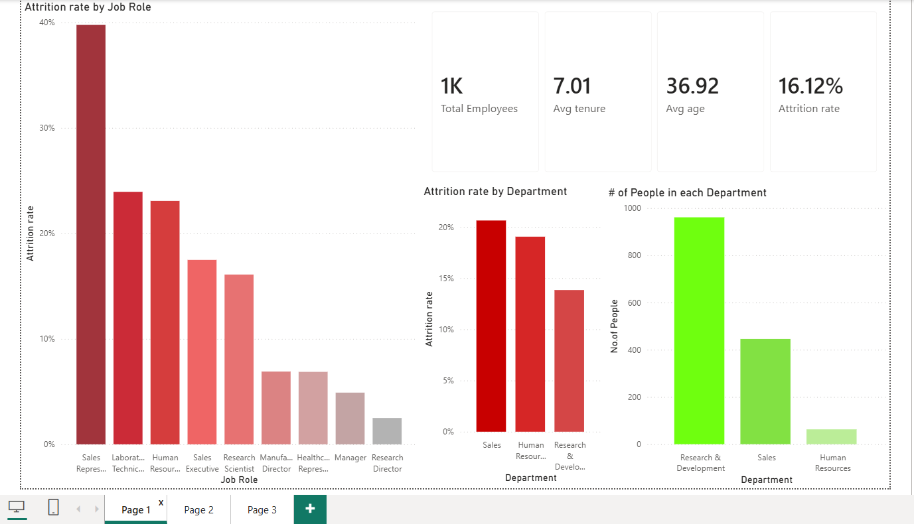
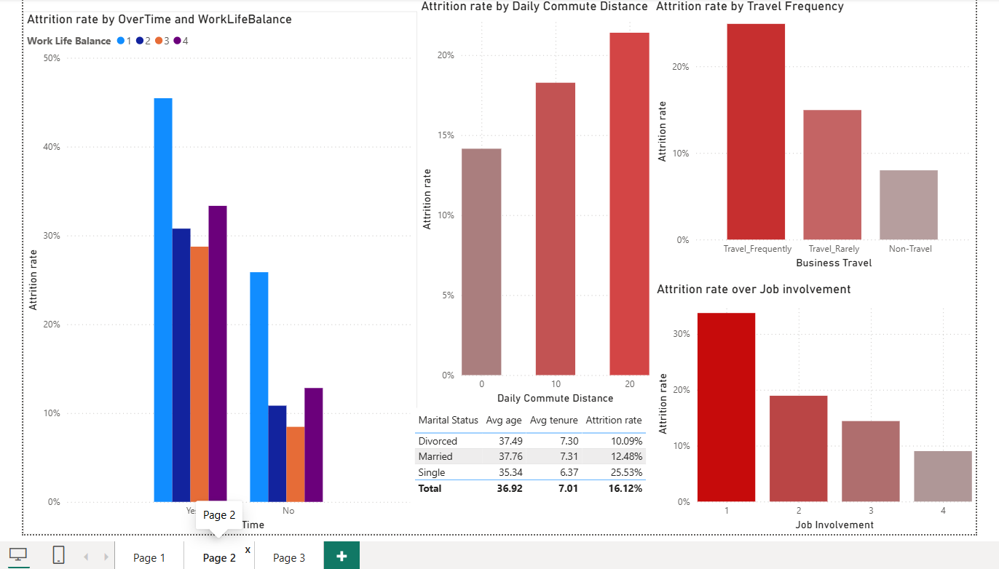
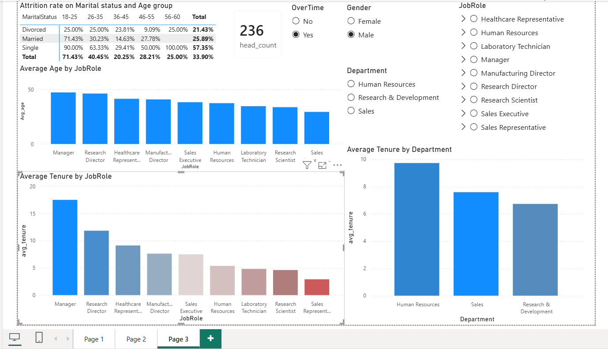

## IBM Employee Attrition Dashboard (Power BI)

A 3-page Power BI report analyzing employee attrition at a fictional IBM-style organization, built on the classic HR Analytics attrition dataset.

## Overview

This project explores what drives employee attrition — department, job role, overtime, work-life balance, business travel, commute distance, marital status, and age — and surfaces the highest-risk employee segments through interactive charts, a pivot table, and slicers.

## Tech Stack
- Power BI Desktop

## Report Pages

### Page 1 — Executive Summary

- KPI cards: Total Employees (1K), Avg Tenure (7.01 yrs), Avg Age (36.92), Attrition Rate (16.12%)
- Attrition rate by Department (clustered column)
- Attrition rate by Job Role (clustered column)
- Headcount by Department (combo chart)

### Page 2 — Work-Life Factors & Behavioral Drivers

- Attrition rate by Job Involvement
- Attrition rate by OverTime and Work-Life Balance
- Attrition rate by Business Travel frequency
- Attrition rate by Daily Commute Distance
- Table: Avg Age, Avg Tenure, and Attrition Rate by Marital Status

### Page 3 — Demographics & Tenure Analysis

- Average Age by Job Role
- Average Tenure by Job Role and by Department
- Pivot table: Attrition rate by Marital Status × Age Group
- Slicers: Job Role, Department, Gender, OverTime
- Headcount KPI card (416) and a "Key Business Discoveries" callout box

### Key Findings
- Single employees aged 18–25 who work overtime have a 76% attrition rate
- Employees aged 36–45 attrit far less than other age groups
- Single male employees aged 18–25 and 56–60 working overtime in Research & Development show 100% attrition

## How to Open
1. Install Power BI Desktop (Windows only)
2. Open IBM.pbix
3. Refresh the data source if prompted

## Screenshots




## PDF for the Report


## Project Structure
```
IBM/
├── IBM.pbix
└── README.md
```

## Author
Pranav K — [Pranav10261](https://github.com/Pranav10261)