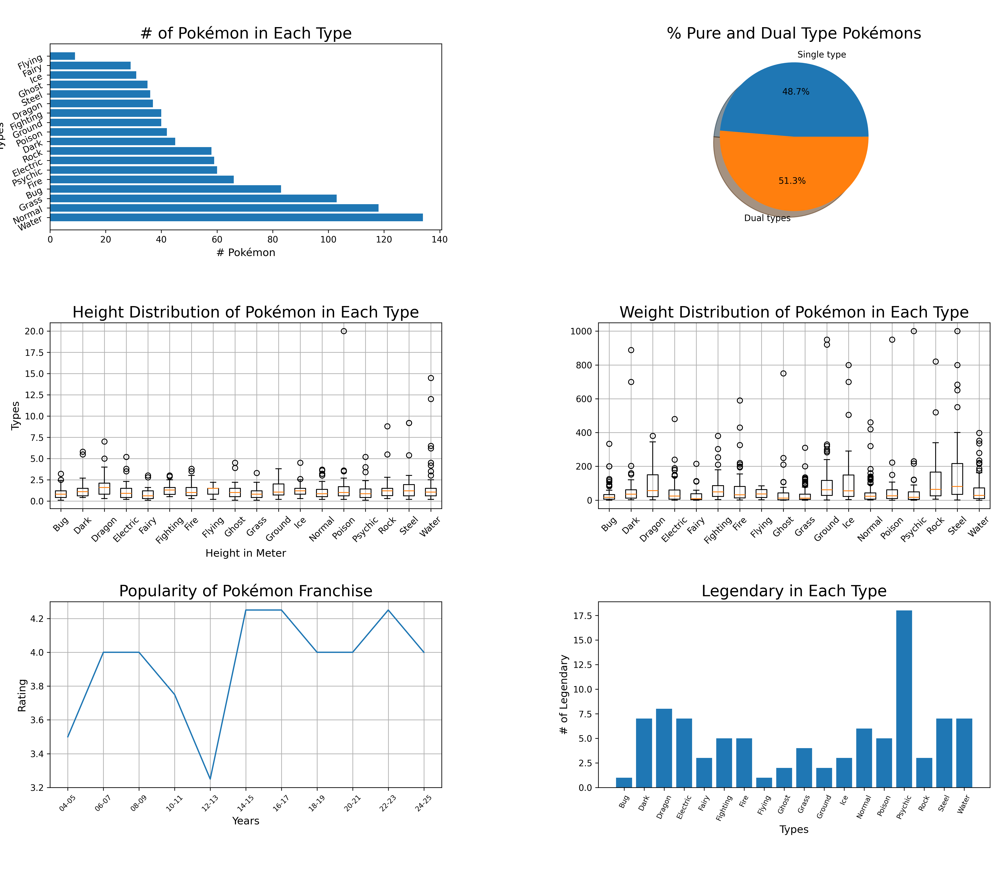

# Pokémon Statistics & Morphological Distribution Analysis

An end-to-end data analytics and ETL project that programmatically extracts species data from the RESTful PokéAPI, cleans and structures the dataset, and performs exploratory data analysis (EDA) to visualize morphological variances, type distributions, and legendary ratios using Pandas and Matplotlib.

## Overview
This script loads a Pokémon dataset and generates charts  on stat comparisons, type distributions and other factors to visually explore the data.

## Key Analytical Discoveries

* **Morphological Variance & Outliers:** While most Pokémon types cluster between 1.0m–1.5m in height and under 100kg in weight, **Steel** and **Water** types exhibit extreme right-skewed weight distributions, with significant high-mass outliers exceeding 800kg.
* **Typing Diversity:** Pure single-type Pokémon account for **48.7%** of the National Pokédex, while dual-type combinations make up **51.3%**, showing a near-even split across all generations.
* **Legendary Distribution Imbalance:** **Psychic** types lead the franchise with the highest proportion of Legendary/Mythical designations (18 Pokémon), substantially outpacing other typings.
* **Type Scarcity:** **Water** and **Normal** represent the most abundant primary typings (>100 species each), whereas primary **Flying** represents the rarest primary categorization.


## Tech Stack & Libraries

* **Language:** Python 3.10+
* **Data Extraction & Ingestion:** `requests` (RESTful API interaction, pagination, JSON normalization)
* **Data Manipulation & Cleaning:** `pandas` (grouping, aggregation, statistical summary)
* **Data Visualization:** `matplotlib` (multi-panel subplots, box plots, horizontal bar charts, pie charts)


## Data Pipeline Architecture

1. **Extraction (`data_gen.py`):**
   * Iterates through 1,025 endpoint entries on the [PokéAPI](https://pokeapi.co/).
   * Normalizes measurement units (converts decimetres to meters and hectograms to kilograms).
   * Resolves multi-type attributes and queries the secondary `pokemon-species` endpoint to flag Legendary/Mythical statuses.
   * Exports the normalized tabular structure directly to `all_pokemon.csv`.

2. **Exploratory Data Analysis (`pokemon_data_chart.py`):**
   * Loads and validates the generated dataset.
   * Calculates grouped metrics and distributions across 18 unique primary types.
   * Generates a 6-panel visualization matrix exported at 300 DPI.

## How to Run
```bash
pip install -r requirements.txt
python "data_gen.py"
python "pokemon_data_chart.py"
```


## Dashboard Visualizations




## Project Structure

```text
pokemon_data_chart/
├── data_gen.py                # Automated ETL script extracting from PokéAPI
├── pokemon_data_chart.py      # Modular EDA and Matplotlib visualization pipeline
├── all_pokemon.csv            # Structured dataset (1,025 rows, 7 features)
├── requirements.txt           # Explicit dependency declarations
├── images/
│   └── Fig_1.png              # High-resolution output dashboard
└── README.md
```


## Author
Pranav K — [Pranav10261](https://github.com/Pranav10261)