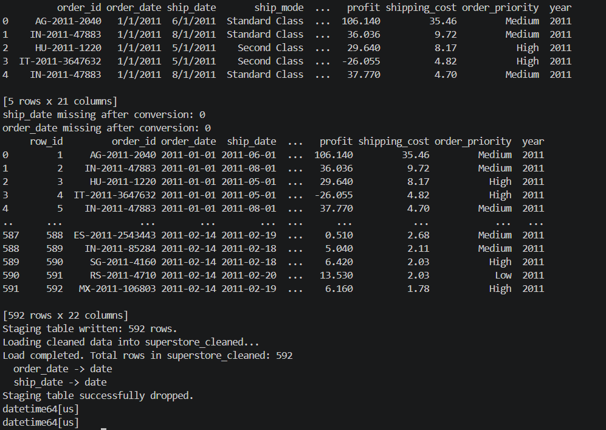

# Sales Analysis Project

An end-to-end sales analytics project combining **Python** (data cleaning), **MySQL** (storage/querying), and **Power BI** (dashboarding), built on the Superstore Orders dataset.

## Overview
Raw order data is loaded into MySQL, cleaned with Python (mixed date formats standardized), written back as a clean table, then explored in an interactive two-page Power BI dashboard covering profit, margin, shipping cost, discounting, and regional performance.

## Tech Stack
- **Python** (pandas, SQLAlchemy) — reads the raw table, fixes `order_date` / `ship_date` typing, writes the cleaned table back
- **MySQL** — stores both the raw (`superstoreorders`) and cleaned (`superstore_cleaned`) tables
- **Power BI** — dashboard and reporting layer

## Data Pipeline & Dashboards

### 1. Python Data Cleaning Output

*Raw data extraction, UTF-8 BOM correction, and datetime conversion executed via Pandas.*

### 2. Executive Overview Dashboard

*High-level KPIs, shipping cost analysis, and regional performance mapping.*

### 3. Category & Segment Detail Dashboard

*Deep dive into profit margins across specific customer segments, discount impacts, and top buyers.*

## Project Structure
```
sales/
├── sales.py            # Loads superstoreorders, fixes date columns, writes superstore_cleaned
├── sales.sql           # Aggregation queries matching each dashboard visual
├── sales.pbix          # Power BI dashboard, connected to superstore_cleaned
├── requirements.txt    # Python dependencies
├── .env.example        # Template for DB credentials — copy to .env and fill in your own
├── .gitignore          # Excludes .env, caches, and raw data from version control
└── README.md
```


## How to Run

1. **Install dependencies**
   ```bash
   pip install -r requirements.txt
   ```

2. **Set up the database**
   - Create a MySQL database named `sales`.
   - Load the raw Superstore CSV into a table called `superstoreorders` (e.g. via MySQL Workbench's Table Data Import Wizard, or `LOAD DATA INFILE`).

3. **Configure credentials**
   - Copy `.env.example` to `.env` and fill in your own `HOST`, `PORT`, `USER`, `PASSWORD`, `DATABASE`.
   - `.env` is git-ignored — never commit real credentials to the repo.

4. **Clean the data**
   ```bash
   python sales.py
   ```
   This reads `sales.superstoreorders`, converts `order_date`/`ship_date` to proper datetimes, and writes the result to `sales.superstore_cleaned`.

5. **Validate with SQL (optional)**
   - Run the queries in `sales.sql` against `sales.superstore_cleaned` to check the numbers you're about to see in Power BI.

6. **Open the dashboard**
   - Open `sales.pbix` in Power BI Desktop.
   - Point the data source at your own MySQL instance (Home → Transform data → Data source settings) and hit **Refresh**.

## Dashboard Pages

**Page 1 — Overview**: total profit, total sales, profit margin %, and order count as KPI cards; average shipping cost by ship mode; profit by discount level; quarterly sales/profit trend; a world map of sales and profit by country.

**Page 2 — Category & Segment Detail**: profit by category and sub-category; discount impact and margin % by category; profit margin % by segment; a per-country margin/sales table; top customers by sales.

## Sample Insights
- Overall profit margin is **8.06%** across 592 orders (~93.8K in total sales, ~7.57K in profit).
- **Corporate** and **Home Office** segments run ~12–13% margin, well above **Consumer** (~2%).
- **Same Day** shipping carries by far the highest average shipping cost of any ship mode.
- Margin swings heavily by country — e.g. **Brazil** and **Denmark** show negative margins, while several African and South American markets exceed 30–40%.

## Author
Pranav K — [Pranav10261](https://github.com/Pranav10261)

